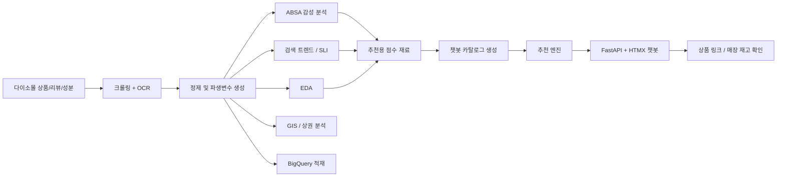
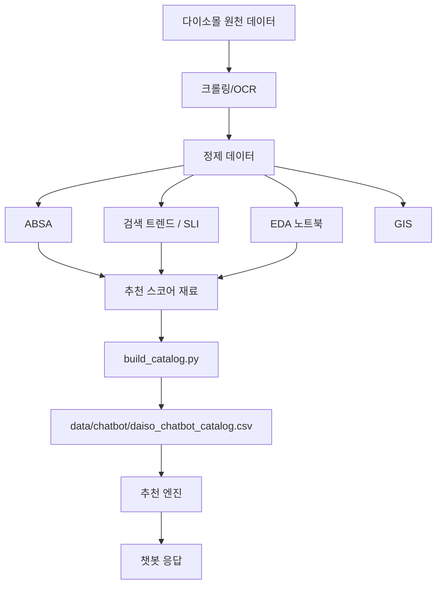

# 다이소 뷰티 통합 프로젝트

다이소 뷰티 상품 데이터를 수집하고, 리뷰와 성분을 분석한 뒤,  
그 결과를 실제 추천 챗봇 서비스까지 연결한 통합 프로젝트입니다.

이 저장소 하나 안에서 아래 흐름이 모두 이어집니다.

- 다이소몰 상품 / 리뷰 / 성분 수집
- OCR 기반 전성분 추출
- 리뷰 감성 분석(ABSA)
- 검색 트렌드 / 연착륙 지표(SLI) 분석
- 외국인 / 유동인구 GIS 분석
- BigQuery 적재
- 추천 엔진 + 웹 챗봇 서비스

이 README는 이 프로젝트를 처음 보는 사람도  
`무슨 프로젝트인지`, `어떤 파일부터 보면 되는지`, `어떻게 실행되는지`를 바로 이해할 수 있게 다시 정리한 문서입니다.

## 1. 30초 요약

이 프로젝트는 크게 2개를 합친 저장소입니다.

1. 다이소 뷰티 **데이터 분석 프로젝트**
2. 분석 결과를 활용한 **추천 챗봇 서비스**

즉, 단순히 분석만 한 프로젝트가 아니라,

`데이터 수집 -> 분석 -> 추천 로직 -> 웹서비스 배포`

까지 이어지는 구조입니다.

쉽게 말하면:

- 어떤 상품이 좋은지 데이터를 보고 찾고
- 사용자가 "건성인데 보습 좋은 거 추천해줘"라고 말하면
- 그 조건에 맞는 제품을 실제로 추천해주는 서비스까지 만든 프로젝트

입니다.

## 2. 이 저장소가 해결하려는 문제

다이소 뷰티는 싸고 접근성이 좋지만, 제품 수가 많고 정보가 흩어져 있어서  
사용자가 "나한테 맞는 상품"을 고르기 쉽지 않습니다.

이 프로젝트는 아래 질문에 답하려고 만들었습니다.

1. 어떤 상품이 단순 유행이 아니라 꾸준히 잘 팔리는가?
2. 리뷰를 보면 고객은 무엇을 좋아하고, 무엇을 불편해하는가?
3. 성분과 안전성은 어떻게 빠르게 확인할 수 있는가?
4. 검색 트렌드와 상권 데이터를 보면 어떤 상품 전략이 맞는가?
5. 이런 분석 결과를 사용자가 바로 쓰게 만들 수 있는가?

그래서 이 저장소는 "분석"과 "서비스"를 따로 두지 않고 한 흐름으로 묶었습니다.

## 3. 프로젝트 전체 구조



## 4. 분석과 챗봇은 어떻게 연결되는가

이 저장소의 핵심은 분석과 챗봇이 이어져 있다는 점입니다.

### 분석 파트

- 상품 / 리뷰 / 성분 데이터 수집
- 감성 분석 결과 생성
- 검색 트렌드와 연착륙 지표 생성
- 상권 / 외국인 유동 분석

### 서비스 파트

- 분석 결과를 추천용 카탈로그로 묶음
- 사용자의 자연어 질문을 조건으로 해석
- 조건에 맞는 제품을 필터링하고 점수화
- 웹 UI에서 추천 결과를 설명과 함께 보여줌

즉 챗봇은 별도 장난감 기능이 아니라,  
이 분석 프로젝트의 결과물을 실제 사용자 경험으로 바꾼 단계입니다.

## 5. 폴더 구조 설명

```text
daiso/
├── data/
│   ├── README.md
│   └── chatbot/
│       └── daiso_chatbot_catalog.csv
├── deploy/
│   ├── .env.example
│   ├── Caddyfile
│   └── duckdns/
├── docs/
│   ├── project/
│   ├── reports/
│   └── storytelling/
├── models/
│   └── query_parser/
├── notebooks/
│   ├── advanced/
│   ├── eda/
│   └── gis/
├── src/
│   ├── absa/
│   ├── acquisition/
│   ├── bigquery/
│   ├── chatbot/
│   ├── common/
│   ├── gis/
│   └── trend/
├── static/
│   └── chatbot/
├── templates/
│   └── chatbot/
├── .dockerignore
├── docker-compose.yml
├── Dockerfile
├── environment.yml
├── README.md
├── render.yaml
├── requirements.txt
├── requirements-chatbot.txt
└── run_chatbot.py
```

## 6. 분석 파트 폴더 설명

### `src/acquisition`

다이소몰에서 상품, 리뷰, 전성분을 수집하는 모듈입니다.

대표 파일:

- `src/acquisition/daiso_beauty_crawler.py`
- `src/acquisition/crawl_history.py`
- `src/acquisition/modules/ingredient_parser.py`
- `src/acquisition/modules/clova_ocr.py`

쉽게 말하면 이 폴더는 "원천 데이터를 가져오는 곳"입니다.

### `src/absa`

리뷰를 aspect별 감성으로 분리해서 분석하는 파이프라인입니다.

예를 들면:

- 가격은 좋은지
- 사용감은 좋은지
- 재구매 의사는 있는지
- 색상/발색은 만족하는지

를 따로 봅니다.

### `src/trend`

검색 트렌드와 연착륙 상품(SLI) 분석 코드를 담고 있습니다.

핵심 질문은:

- 잠깐 유행한 상품이 아니라 꾸준히 가는 상품은 무엇인가?
- 검색량 패턴은 어떻게 다른가?

입니다.

### `src/gis`

외국인 생활인구와 유동인구 데이터를 이용해 상권 전략을 분석합니다.

쉽게 말하면:

- 어디에 외국인이 많은지
- 시간대별로 어디가 붐비는지
- 어떤 지역을 Hub / Spoke로 볼지

를 계산하는 폴더입니다.

### `src/bigquery`

정제된 데이터를 BigQuery에 적재하고, 대시보드용 구조를 만드는 코드입니다.

## 7. 챗봇 파트 폴더 설명

### `src/chatbot`

추천 챗봇의 핵심 로직이 들어 있습니다.

대표 파일:

- `src/chatbot/app.py`
  - FastAPI 앱
- `src/chatbot/engine.py`
  - 추천 점수 계산 로직
- `src/chatbot/query_parser.py`
  - 사용자 질문 해석
- `src/chatbot/local_query_parser.py`
  - 로컬 질의 파서
- `src/chatbot/build_catalog.py`
  - 추천용 카탈로그 생성
- `src/chatbot/models.py`
  - 응답 모델

### `templates/chatbot`

챗봇 화면 템플릿입니다.

- `templates/chatbot/index.html`
- `templates/chatbot/_exchange.html`

### `static/chatbot`

챗봇 UI 스타일과 로고, JS 파일이 들어 있습니다.

- `static/chatbot/styles.css`
- `static/chatbot/app.js`
- `static/chatbot/daiso_rogo.png`

### `run_chatbot.py`

챗봇 실행 진입 파일입니다.

## 8. 데이터가 어떻게 흐르는가



## 9. 추천 챗봇은 어떻게 동작하는가

사용자가 예를 들어 이렇게 말합니다.

- `건성인데 보습 좋은 크림 추천해줘`
- `3천 원 이하 순한 스킨케어 보여줘`
- `리뷰 많은 클렌징 제품 보여줘`

그러면 챗봇은 아래 순서로 움직입니다.

1. 질문에서 예산, 카테고리, 피부 고민, 원하는 효과를 추출
2. 카탈로그에서 조건에 맞는 후보를 필터링
3. 감성 분석, 평점, 인기도, 재구매율, 가성비, 성분 등을 합쳐 점수 계산
4. 상위 제품을 이유와 함께 반환
5. 실제 다이소몰 상품 링크와 재고 확인 링크 제공

즉, 단순 검색창이 아니라 **추천 엔진이 붙은 챗봇**입니다.

## 10. 챗봇 추천 점수의 핵심 아이디어

이 챗봇은 단순 평점순 정렬이 아닙니다.

기본적으로 아래 요소를 함께 반영합니다.

- 감성 분석 결과
- 연착륙 지표(SLI)
- 인기도
- 평점
- 가성비
- 재구매율
- 성분 / 안전성 관련 조건

또한 사용자의 질문에 따라 강조점이 달라집니다.

예를 들어:

- `가성비 좋은 거`라고 하면 가성비 쪽 비중이 커지고
- `순한 거`라고 하면 성분 / 안전성 쪽 비중이 커지고
- `인기 많은 거`라고 하면 인기도 비중이 커집니다

## 11. 처음 보는 사람에게 추천하는 읽는 순서

처음 이 저장소를 보는 사람이라면 아래 순서가 가장 이해하기 쉽습니다.

1. 이 README
2. `docs/reports/다이소_통합_최종보고서.md`
3. `docs/reports/ABSA_통합분석_보고서.md`
4. `docs/reports/SLI_최종_결과_보고서.md`
5. `src/acquisition/README.md`
6. `src/gis/README.md`
7. `src/bigquery/README.md`
8. `docs/project/CHATBOT_APP.md`
9. `docs/project/CHATBOT_DEPLOY_QUICKSTART.md`

## 12. 분석 파트 실행 방법

이 저장소는 "웹앱 하나만 켜는 프로젝트"가 아니라,  
분석 단계별 코드와 노트북을 보는 구조입니다.

### 12-1. 환경 설치

Conda를 쓰는 경우:

```bash
conda env create -f environment.yml
conda activate daiso-project
```

pip를 쓰는 경우:

```bash
pip install -r requirements.txt
```

### 12-2. 크롤링

```bash
python src/acquisition/daiso_beauty_crawler.py
```

### 12-3. 노트북 추천 순서

EDA:

1. `notebooks/eda/daiso1_데이터검증_전처리.ipynb`
2. `notebooks/eda/daiso2_분석용 데이터 파일 생성.ipynb`
3. `notebooks/eda/daiso3_EDA1_시각화.ipynb`
4. `notebooks/eda/daiso4_EDA2_재구매.ipynb`
5. `notebooks/eda/daiso5_EDA3_듀프.ipynb`
6. `notebooks/eda/daiso6_기능성화장품_api.ipynb`
7. `notebooks/eda/daiso7_SLI_사전기반.ipynb`

고급 분석:

- `notebooks/advanced/daiso9_ABSA_감성분석.ipynb`

GIS:

- `notebooks/gis/daiso12_최종_외국인_밀집지역_분석.ipynb`
- `notebooks/gis/daiso16_GIS(물류효율1).ipynb`
- `notebooks/gis/daiso17_GIS(물류효율2).ipynb`

## 13. 챗봇 파트 실행 방법

### 13-1. 챗봇 의존성 설치

```bash
pip install -r requirements-chatbot.txt
```

### 13-2. 추천 카탈로그 생성

```bash
python src/chatbot/build_catalog.py
```

이 명령이 끝나면 아래 파일이 만들어집니다.

- `data/chatbot/daiso_chatbot_catalog.csv`

### 13-3. 로컬 실행

```bash
python -m uvicorn run_chatbot:app --reload
```

또는

```bash
python run_chatbot.py
```

브라우저:

```text
http://127.0.0.1:8000
```

### 13-4. 챗봇 관련 환경 변수

자주 쓰는 값은 아래입니다.

```env
DAISO_QUERY_PARSER_BACKEND=rule
OPENAI_API_KEY=
DAISO_CHATBOT_MODEL=gpt-4o-mini
DAISO_HOST=127.0.0.1
DAISO_PORT=8000
DAISO_RELOAD=true
```

설명:

- `rule`
  - 규칙 기반만 사용
- `local`
  - 로컬 질의 파서 우선 사용
- `openai`
  - OpenAI 기반 파서 사용
- `auto`
  - local -> openai -> rule 순서로 폴백

## 14. 배포 방법

이 저장소는 챗봇 기준으로 바로 배포 가능한 파일을 포함하고 있습니다.

포함된 파일:

- `Dockerfile`
- `docker-compose.yml`
- `deploy/.env.example`
- `deploy/Caddyfile`
- `render.yaml`

### 14-1. Docker 실행

```bash
docker compose up -d --build
```

### 14-2. DuckDNS / Caddy / EC2

도메인과 HTTPS까지 붙이려면:

- `deploy/.env.example`
- `deploy/Caddyfile`
- `docs/project/CHATBOT_APP.md`
- `docs/project/CHATBOT_DEPLOY_QUICKSTART.md`

를 참고하면 됩니다.

## 15. Notion 임베드 대응

챗봇은 `/embed` 경로를 제공합니다.

예:

```text
https://your-domain/embed
```

이 경로는 외부 임베드 시도를 고려해 만든 경로입니다.

## 16. 데이터 정책

대용량 원천 데이터나 중간 산출물은 전부 Git에 올리지 않습니다.

보통 제외되는 것:

- 크롤링 원본 CSV
- OCR 중간 산출물
- 대용량 GIS 원본 파일
- BigQuery 적재 중간 파일

하지만 챗봇 실행에 꼭 필요한 가벼운 파일은 예외로 포함합니다.

- `data/chatbot/daiso_chatbot_catalog.csv`
- `static/chatbot/daiso_rogo.png`

## 17. 이 저장소에서 특히 보강한 점

이번 통합 작업에서는 단순히 파일만 붙이지 않고 아래를 정리했습니다.

- 분석 프로젝트와 챗봇 프로젝트를 하나의 흐름으로 통합
- 챗봇 코드를 `src/chatbot`, `templates/chatbot`, `static/chatbot` 구조로 포함
- Docker / DuckDNS / Caddy 배포 파일 포함
- 챗봇 카탈로그 파일을 저장소 구조에 맞게 포함
- 루트 README를 통합형 문서로 전면 개편

## 18. 한 줄 요약

이 저장소는 다이소 뷰티 데이터를 수집하고 분석한 뒤,  
그 결과를 실제 추천 챗봇 서비스까지 연결한 **분석 + 서비스 통합 프로젝트**입니다.
