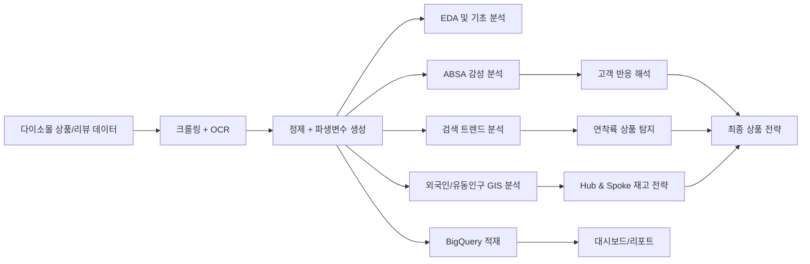
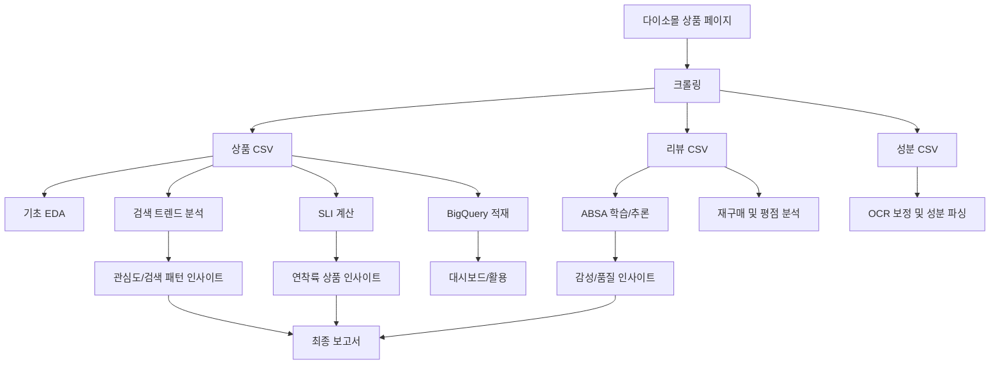

# 다이소 뷰티 데이터 프로젝트

다이소 뷰티 상품, 리뷰, 성분, 검색 트렌드, 외국인 유동인구 데이터를 함께 분석해서  
`어떤 상품을 키워야 하는지`, `어떤 리스크를 미리 막아야 하는지`, `어디에 어떤 재고를 더 배치해야 하는지`를 찾는 프로젝트입니다.

이 README는 이 저장소를 처음 보는 사람도 바로 이해할 수 있게 쓰였습니다.

## 1. 30초 요약

이 프로젝트는 크게 3가지 질문에 답하려고 만든 분석 프로젝트입니다.

1. 다이소 뷰티에서 오래 잘 팔리는 상품은 무엇인가?
2. 리뷰를 보면 고객이 좋아하는 점과 싫어하는 점은 무엇인가?
3. 외국인과 유동인구 데이터를 보면 어떤 상권에 어떤 상품을 더 밀어야 하는가?

이를 위해 아래 작업을 연결했습니다.

- 다이소몰 상품/리뷰/성분 크롤링
- OCR 기반 전성분 추출
- 리뷰 감성 분석(ABSA)
- 네이버 검색 트렌드 분석
- 연착륙 상품 지표(SLI) 설계
- 외국인 밀집지역 및 유동인구 GIS 분석
- BigQuery 적재 및 대시보드용 뷰 설계

## 2. 이 프로젝트가 해결하려는 문제

다이소 뷰티는 싸고 접근성이 좋지만, 제품이 많고 품질 편차도 있어서 단순히 "싸다"만으로는 계속 성장하기 어렵습니다.

이 프로젝트는 아래 문제를 데이터로 풀려고 했습니다.

- 어떤 상품이 잠깐 유행이 아니라 꾸준히 잘 팔리는지
- 고객이 제품의 어떤 점을 좋아하고 싫어하는지
- 안전성과 성분 리스크를 어떻게 빠르게 확인할 수 있는지
- 관광 상권과 거주 상권의 재고 전략을 어떻게 다르게 가져가야 하는지

쉽게 말하면,

`좋은 상품은 더 잘 보이게 만들고, 위험한 상품은 빨리 걸러내고, 잘 팔릴 곳에 재고를 더 두자`

가 이 프로젝트의 핵심입니다.

## 3. 프로젝트 한눈에 보기



## 4. 이 저장소에서 실제로 하는 일

이 저장소는 "다이소 뷰티 전체 프로젝트의 핵심 코드와 보고서"를 담은 compact 버전입니다.

팀원 정리본 저장소는 폴더를 더 크게 나눠서:

- `03_notebooks`
- `04_docs`
- `05_src`
- `06_analysis`

형태로 정리돼 있지만, 이 저장소는 기능별로 더 직접적인 구조를 사용합니다.

즉:

- `src/acquisition` : 데이터 수집
- `src/absa` : 감성 분석
- `src/trend` : 검색 트렌드 / SLI
- `src/gis` : 외국인 / 유동인구 / 물류 전략
- `src/bigquery` : BigQuery 적재와 뷰 설계
- `notebooks/` : 분석 노트북
- `docs/` : 보고서와 설계 문서

으로 이해하면 됩니다.

## 5. 폴더 구조 설명

```text
daiso/
├── data/
│   └── README.md
├── docs/
│   ├── project/
│   ├── reports/
│   └── storytelling/
├── notebooks/
│   ├── eda/
│   ├── advanced/
│   └── gis/
├── src/
│   ├── acquisition/
│   ├── absa/
│   ├── trend/
│   ├── gis/
│   ├── bigquery/
│   └── common/
├── environment.yml
├── requirements.txt
├── hub_spoke_store_map_final.html
└── README.md
```

### `src/acquisition`

다이소몰에서 상품, 리뷰, 전성분을 수집하는 모듈입니다.

핵심 기능:

- 상품 상세 정보 수집
- 리뷰 수집
- 이미지 ALT 텍스트 추출
- OCR 기반 전성분 인식
- OCR 오인식 보정
- 증분 크롤링 이력 관리

대표 파일:

- `src/acquisition/daiso_beauty_crawler.py`
- `src/acquisition/modules/ingredient_parser.py`
- `src/acquisition/modules/clova_ocr.py`
- `src/acquisition/crawl_history.py`

### `src/absa`

리뷰를 aspect별 감성으로 분류하는 파이프라인입니다.

쉽게 말하면:

- "가격이 좋은지"
- "사용감이 좋은지"
- "재구매하고 싶은지"
- "색상/발색이 좋은지"

같은 항목을 따로 나눠서 분석합니다.

구성은 stage별 파일로 나뉘어 있습니다.

- `s1_config.py` : 설정
- `s2_sampling.py` : 학습용 샘플링
- `s3_labeling.py` : 라벨링
- `s4_dataset.py` : 데이터셋 구성
- `s5_model.py` : 모델 정의
- `s6_train.py` : 학습
- `s7_evaluation.py` : 평가
- `s8_inference.py` : 전체 추론

### `src/trend`

네이버 검색량과 검색 트렌드를 이용해 연착륙 상품을 찾는 모듈입니다.

핵심 질문:

- 초반 반짝 인기가 아니라 나중까지 유지되는 상품은 무엇인가?
- 연착륙 상품과 비연착륙 상품의 검색 패턴은 어떻게 다른가?

대표 파일:

- `run_anchor_analysis.py`
- `run_anchor_search_trend.py`
- `run_soft_landing_segment_analysis.py`
- `run_soft_landing_search_trend.py`
- `visualize_soft_landing.py`

### `src/gis`

외국인 생활인구와 S-DoT 유동인구를 결합해 상권 전략을 짜는 모듈입니다.

쉽게 말하면:

- 외국인이 많이 모이는 곳은 어디인지
- 시간대별로 사람이 많은 곳은 어디인지
- 어떤 지역을 Hub, 어떤 지역을 Spoke로 둘지

를 계산합니다.

대표 파일:

- `daiso13_sdot_temporal_analysis.py`
- `daiso14_analysis_2024_2025.py`
- `daiso15_foreigner_analysis.py`

### `src/bigquery`

수집/가공된 데이터를 BigQuery로 올리고, Tableau나 대시보드에서 보기 좋은 뷰를 만드는 모듈입니다.

대표 파일:

- `bq_client.py`
- `etl_loader.py`
- `migrate_v3.py`

### `notebooks/`

분석 과정이 노트북 형태로 정리돼 있습니다.

- `notebooks/eda` : 데이터 검증, 전처리, 기초 분석
- `notebooks/advanced` : ABSA, 검색트렌드, 인과분석
- `notebooks/gis` : GIS와 외국인 분석

### `docs/`

결과를 설명하는 문서가 모여 있습니다.

- `docs/reports` : 최종 보고서
- `docs/project` : 구조 설명, 보조 README
- `docs/storytelling` : 발표용 스토리 근거

## 6. 핵심 산출물

이 프로젝트에서 중요한 산출물은 아래 5가지입니다.

### 1) 크롤링 + OCR 파이프라인

다이소몰 제품 정보를 수집하고, 이미지에서 전성분을 읽어내는 파이프라인입니다.

### 2) ABSA 감성 분석

리뷰를 "좋다/나쁘다" 수준에서 끝내지 않고, 어떤 aspect에 대해 그렇게 말했는지까지 분리합니다.

### 3) SLI(연착륙 지표)

초반 인기만 높은 상품이 아니라, 시간이 지나도 유지되는 상품을 찾는 지표입니다.

### 4) GIS 기반 Hub & Spoke 전략

유동인구와 관광객 데이터를 통해 어떤 지역에 재고를 더 깊게 둘지 판단합니다.

### 5) BigQuery + 대시보드 기반 활용 구조

분석 결과를 저장하고 실제 대시보드로 연결할 수 있는 기반을 만듭니다.

## 7. 데이터가 어떻게 흐르는가



## 8. 실행은 어떻게 하나요?

이 저장소는 "웹앱 하나를 실행하는 프로젝트"가 아니라,  
분석 단계별로 스크립트와 노트북을 실행하는 구조입니다.

그래서 보통 아래 순서로 봅니다.

### 8-1. 환경 설치

Conda를 쓰는 경우:

```bash
conda env create -f environment.yml
conda activate daiso-project
```

pip를 쓰는 경우:

```bash
pip install -r requirements.txt
```

### 8-2. 크롤링

대표 진입 파일:

```bash
python src/acquisition/daiso_beauty_crawler.py
```

이 단계에서 상품, 리뷰, 성분 데이터가 만들어집니다.

주의:

- Selenium/Chrome 환경이 필요합니다.
- OCR API, `.env` 등 외부 설정이 필요할 수 있습니다.
- 자세한 내용은 `src/acquisition/README.md` 참고

### 8-3. EDA / 전처리

기초 분석은 노트북 기준으로 진행합니다.

추천 순서:

1. `notebooks/eda/daiso1_데이터검증_전처리.ipynb`
2. `notebooks/eda/daiso2_분석용 데이터 파일 생성.ipynb`
3. `notebooks/eda/daiso3_EDA1_시각화.ipynb`
4. `notebooks/eda/daiso4_EDA2_재구매.ipynb`
5. `notebooks/eda/daiso5_EDA3_듀프.ipynb`
6. `notebooks/eda/daiso6_기능성화장품_api.ipynb`
7. `notebooks/eda/daiso7_SLI_사전기반.ipynb`

### 8-4. ABSA

ABSA는 stage별 스크립트 순서로 진행됩니다.

기본 흐름:

1. `s1_config.py`
2. `s2_sampling.py`
3. `s3_labeling.py`
4. `s4_dataset.py`
5. `s5_model.py`
6. `s6_train.py`
7. `s7_evaluation.py`
8. `s8_inference.py`

실험/검증 노트북은:

- `notebooks/advanced/daiso9_ABSA_감성분석.ipynb`

### 8-5. 검색 트렌드 / 연착륙 분석

대표 실행 파일:

```bash
python src/trend/run_anchor_analysis.py
python src/trend/run_anchor_search_trend.py
python src/trend/run_soft_landing_segment_analysis.py
python src/trend/run_soft_landing_search_trend.py
```

### 8-6. GIS / 외국인 분석

대표 분석 노트북:

- `notebooks/gis/daiso12_최종_외국인_밀집지역_분석.ipynb`
- `notebooks/gis/daiso16_GIS(물류효율1).ipynb`
- `notebooks/gis/daiso17_GIS(물류효율2).ipynb`

### 8-7. BigQuery 적재

BigQuery 관련 설명과 적재 방법은:

- `src/bigquery/README.md`

를 먼저 보는 것이 가장 빠릅니다.

## 9. 결과를 읽는 가장 쉬운 순서

처음 보는 사람에게 추천하는 읽기 순서는 아래와 같습니다.

1. 이 README
2. `docs/reports/다이소_통합_최종보고서.md`
3. `docs/reports/ABSA_통합분석_보고서.md`
4. `docs/reports/SLI_최종_결과_보고서.md`
5. `docs/reports/ERD.md`
6. `src/acquisition/README.md`
7. `src/gis/README.md`
8. `src/bigquery/README.md`

## 10. 팀원 정리본과의 관계

팀원 정리본 경로:

`C:\Users\GAZI\Desktop\A_Proj\다이소\Daiso_Cosmetic_analysis-main`

그 저장소는 문서와 분석 결과를 더 세분화해서 정리한 버전입니다.

이 저장소와의 차이는 아래처럼 이해하면 됩니다.

- 이 저장소: 기능별로 바로 찾기 쉬운 compact 버전
- 팀원 정리본: 발표/문서/분석 축으로 더 크게 재배치한 archive 성격의 버전

즉 "핵심 코드와 노트북을 보기 쉬운 버전"은 이 저장소이고,  
"문서 체계와 스토리라인까지 크게 정리된 버전"은 팀원 정리본에 가깝습니다.

## 11. 이 저장소에서 바로 확인할 수 있는 대표 질문

이 프로젝트를 읽을 때 아래 질문에 답할 수 있으면 전체를 잘 이해한 것입니다.

- 다이소 뷰티에서 꾸준히 잘 팔리는 상품은 무엇인가?
- 그 상품들은 리뷰에서 어떤 점이 좋다고 평가받는가?
- 가격/성분/재구매율/검색량은 어떤 관계가 있는가?
- 외국인 관광객이 많은 지역과 거주 지역의 전략은 어떻게 달라야 하는가?
- 크롤링부터 분석, 보고서까지 파이프라인이 어떻게 이어지는가?

## 12. 데이터 정책

원천 데이터와 대용량 산출물은 GitHub에 전부 올라가 있지 않습니다.

보통 아래는 제외됩니다.

- 크롤링 원본 CSV
- OCR 중간 산출물
- 대용량 GIS 원본 데이터
- BigQuery 적재 중간 파일
- 발표용 대용량 이미지/PDF 원본

관련 안내:

- `data/README.md`

## 13. 이 README에서 특히 보강한 점

기존 README는 프로젝트 배경과 성과는 강했지만, 처음 보는 사람이 아래를 이해하기에는 어려운 부분이 있었습니다.

- 실제 폴더가 어떤 역할을 하는지
- 어디부터 읽어야 하는지
- 어떤 파일이 진입점인지
- 팀원 정리본과 이 저장소의 관계가 무엇인지

그래서 이번 README는 아래를 보강했습니다.

- 중학생도 읽을 수 있는 설명
- 폴더별 역할 설명
- 단계별 실행 흐름
- Mermaid 아키텍처 다이어그램
- 문서 읽는 순서
- compact repo와 정리본 repo의 차이 설명

## 14. 한 줄 요약

다이소 뷰티 상품과 리뷰 데이터를 수집하고, 감성 분석·검색 트렌드·GIS 분석까지 연결해서  
`무슨 상품을 키우고`, `무슨 리스크를 막고`, `어느 지역에 재고를 더 둘지`를 데이터로 설명하는 프로젝트입니다.
